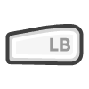

# Basic Controller Controls

 Jump

 [Empty]

 NPC Interaction / Use Item

 [Empty]

 Player Menu

 [Empty]

 [Empty]

 [Empty]

 Movement

 [Empty] (Click)

 Move Camera

 [Empty] (Click)

 Quest Log

 Escape Menu

 Hotkey Bar: Scroll Left

 Hotkey Bar: Scroll Right

 Secondary Hand

 Attack