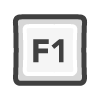
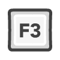
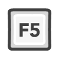
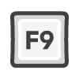
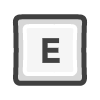

# Basic Keyboard Controls

<table style="table-layout:fixed;width:100%;word-break:break-all;text-aligin:center;font-size:12px">
	<tr>
		<td></th>
		<td></th>
		<td></th>
		<td></th>
		<td></th>
		<td></th>
		<td></th>
		<td></th>
		<td></th>
		<td></th>
		<td></th>
		<td></th>
		<td></th>
	</tr>
	<tr>
		<td>Escape Menu</th>
		<td>Hide UI</th>
		<td>Screenshot</th>
		<td>[Empty]</th>
		<td>[Empty]</th>
		<td>Camera Perspective</th>
		<td>[Empty]</th>
		<td>[Empty]</th>
		<td>Mouse Smoothing</th>
		<td>[Empty]</th>
		<td>[Empty]</th>
		<td>Fullscreen Toggle</th>
		<td>[Empty]</th>
	</tr>
</table>

 -  Hotkeys

 Dashboard

 Move Camera

 Attack

 NPC Interaction & Use Item

 Move Forward

 Sprint

 Move Backwards

 Strafe Left

 Strafe Right

 Jump

 Sneak

 Player Menu

 Inventory

 View Stats

 Quest Log

 Open Chat

 Player Interaction